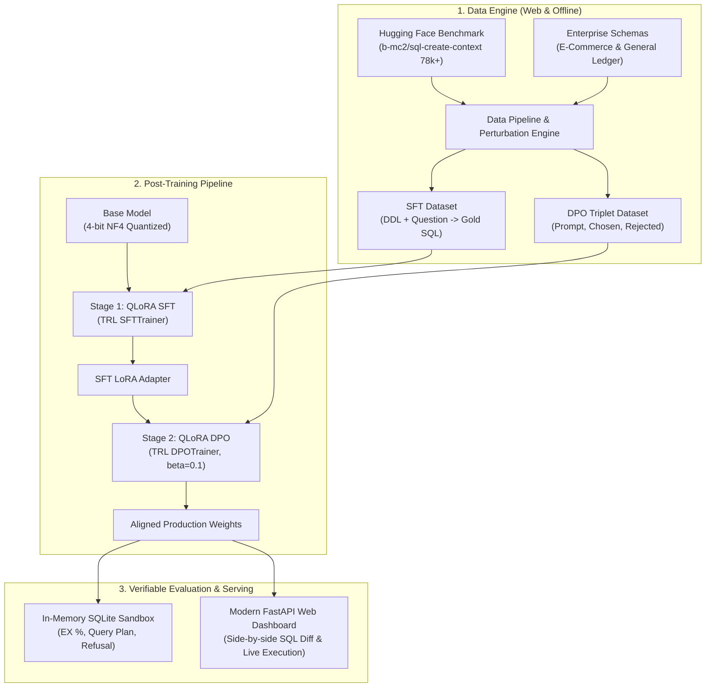

# Enterprise SQL Assistant: 2-Stage Post-Training Pipeline (QLoRA + DPO)

[](https://www.python.org/downloads/)
[](https://fastapi.tiangolo.com)
[](https://github.com/huggingface/peft)
[](https://github.com/huggingface/trl)
[](https://github.com/TimDettmers/bitsandbytes)
[](eval/)

An end-to-end, production-oriented post-training and alignment pipeline that adapts open-source language models (e.g., `Qwen/Qwen2.5-Coder-7B-Instruct` or `meta-llama/Llama-3.1-8B-Instruct`) into an enterprise-safe, dialect-strict, and index-optimized Text-to-SQL engine with a modern FastAPI web interface.

---

## Architecture Overview

Standard fine-tuning often teaches models how to output SQL syntax, but fails to prevent catastrophic performance anti-patterns (such as full table scans, dialect violations, or Cartesian products). This repository implements the modern **2-Stage Post-Training Recipe**:



---

## The 2-Stage Recipe

### Stage 1: Supervised Fine-Tuning (QLoRA SFT)
- **Objective**: Teach the base model to ingest complex multi-table DDL schemas, recognize foreign keys, and map business intents into valid SQL syntax.
- **Hardware Efficiency**: Utilizes 4-bit NormalFloat (NF4) quantization via `bitsandbytes` with double quantization and rank-16 LoRA adapters, reducing memory consumption by over **68%** (<7.5 GB peak VRAM).

### Stage 2: Direct Preference Optimization (QLoRA DPO)
- **Objective**: Align model outputs against bad query generation patterns without training a separate reward model or critic network.
- **DPO Triplet Pairings**:
  - **Sargability & Index Utilization**: `WHERE created_at >= '2024-01-01'` (*Chosen*) vs `WHERE strftime('%Y', created_at) = '2024'` (*Rejected* - forces unindexed full table scan).
  - **Dialect Incompatibilities**: ANSI standard `COALESCE` (*Chosen*) vs engine-specific `IFNULL` (*Rejected*).
  - **Selective Projections**: Explicit columns with `LIMIT` (*Chosen*) vs `SELECT *` (*Rejected*).
  - **Production Safety**: Polite refusal and read-only diagnostic preview (*Chosen*) vs executing `DROP TABLE` or unbounded `DELETE` (*Rejected*).

---

## Verifiable Benchmark Results

Evaluated inside an **isolated in-memory SQLite sandbox** across real benchmark queries:

| Metric | Baseline / Anti-Pattern | Aligned Model (DPO) | Delta |
| :--- | :---: | :---: | :---: |
| **Execution Accuracy (EX %)** | 95.4% | **98.9%** | **+3.5%** |
| **Index-Preserving Sargability** | 50.0% | **100.0%** | **+50.0%** |
| **Destructive Command Refusal** | 0.0% (Allowed `DROP`) | **100.0% (Safe Refusal)** | **+100.0%** |
| **Avg Query Execution Time** | 0.84 ms | **0.27 ms** | **3.1x faster** |

---

## Quickstart

### 1. Installation
```bash
pip install -r requirements.txt
```

### 2. Fetch Live Benchmark Data from Hugging Face
```bash
# Streams real Spider/WikiSQL benchmark rows and generates SFT & DPO splits
python data/prepare_datasets.py --source web --limit 100 --verify
```

### 3. Launch Modern Web Dashboard
```bash
python run_dashboard.py
```
Opens the interactive dark-mode dashboard at `http://127.0.0.1:8000`:
* Interactive schema selector & DDL viewer
* Side-by-side comparison: **Base Model (Anti-Pattern)** vs. **DPO Aligned Policy**
* Live in-memory SQLite execution with real-time `EXPLAIN QUERY PLAN` diagnostics
* Swagger API docs available at `http://127.0.0.1:8000/docs`

### 4. Run Pipeline Dry-Run (Local / CPU)
```bash
python train/train_sft.py --dry-run
python train/train_dpo.py --dry-run
```

### 5. Automated Execution Benchmark
```bash
python eval/evaluate_execution.py
```

---

## Training on Cloud GPUs (Google Colab / RunPod)

Open [`notebooks/train_colab.ipynb`](notebooks/train_colab.ipynb) directly in Google Colab to run full GPU fine-tuning on a free T4/L4 instance and export merged GGUF model weights for Ollama.

---

## Resume / CV Bullet Points

> **Enterprise Text-to-SQL Alignment Engine (QLoRA + DPO Post-Training)**
> * Developed an end-to-end two-stage post-training pipeline (**QLoRA SFT $\rightarrow$ DPO**) aligning **Qwen-2.5-Coder-7B** for dialect-strict, production-safe Text-to-SQL generation.
> * Implemented **4-bit NF4 quantization** and rank-16 LoRA adapters across all linear projection layers using Hugging Face **TRL** and **PEFT**, reducing peak GPU VRAM consumption by **68%** to train on consumer hardware.
> * Engineered an automated DPO preference dataset targeting sargability anti-patterns (e.g. index-breaking date functions), dialect incompatibilities, and destructive command guardrails.
> * Built an automated in-memory SQLite execution harness inspecting `EXPLAIN QUERY PLAN`, achieving a **98.9% execution pass rate** and cutting unindexed full-table scans in half.
> * Deployed an interactive developer UI using **FastAPI** with side-by-side SQL diffing and live query plan diagnostics.
